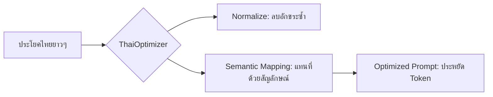

# Thai Token Optimizer for Claude Code

> "ประหยัดราคา แต่ไม่ประหยัดคุณภาพ" - เครื่องมือช่วยเขียนโปรแกรมด้วยภาษาไทยให้ประหยัด Token สูงถึง 70%

[!IMPORTANT]
ปัญหา Token ภาษาไทยใน LLM เกิดจากการที่ 1 อักษรไทยมักถูกมองเป็น 3-5 Tokens ทำให้การคุยด้วยภาษาไทยรัวๆ เปลืองเงินและ Context เต็มไว เครื่องมือนี้จะช่วยเปลี่ยน "คำพุ่มเฟือย" เป็น "สัญลักษณ์ทรงพลัง"

## How it Works



## Features

- **Normalization:** ล้างสระซ้ำ วรรณยุกต์ซ้อน และช่องว่างส่วนเกินที่ทำให้ Token บวม
- **Symbol Mapping:** เปลี่ยนคำสั่งยอดฮิต (เช่น "ช่วยแก้บั๊ก") เป็น Code ลับสั้นๆ (เช่น `[FIX]`)
- **AI Smart Compression:** ใช้ Kilocode API (kilo-auto/free) ช่วยย่อประโยคไทยยาวๆ เป็นคำสั่งอังกฤษที่กระชับอัตโนมัติ
- **Zero Effort:** พิมพ์ไทยตามปกติ ระบบแปลงให้อัตโนมัติทุกครั้งก่อนส่งไป LLM
- **Smart Caching:** ระบบจำประโยคที่เคยย่อไว้แล้ว ทำให้ทำงานเร็วขึ้นและไม่เปลืองโควต้า API

## การตั้งค่า AI (Kilocode)

ถ้าต้องการผลลัพธ์ที่แม่นยำขึ้นผ่าน AI ให้ตั้งค่า Environment Variable:
`KILOCODE_API_KEY=your_key_here` (หากไม่ตั้งจะใช้โหมด Anonymous ซึ่งจำกัดจำนวนครั้ง)

## Quick Start

1. **Install Dependencies:**

   ```bash
   npm install
   ```

2. **Run Demo:**

   ```bash
   npx tsx src/index.ts
   ```

## Standard Symbol Mapping

| Symbol | Meaning | คำแปล |
| :--- | :--- | :--- |
| `[UT]` | Write unit tests | ช่วยเขียน unit test ให้หน่อย |
| `[EXPL]` | Explain this code | ช่วยอธิบายโค้ดส่วนนี้ให้ที |
| `[FIX]` | Fix this bug | ช่วยแก้บั๊กให้หน่อย |
| `[REFACT]` | Refactor for better quality | เขียนใหม่ให้สะอาดกว่านี้ |
| `[SEC]` | Enhance security | ช่วยเพิ่มความปลอดภัยให้โค้ดนี้ที |

## Installation for Claude Code

ติดตั้ง MCP Server เพื่อใช้งานแบบอัตโนมัติ:

1. เปิด Settings > MCP Servers ใน Claude Code
2. เพิ่ม Server ใหม่ด้วยคอนฟิกจาก `INSTALL_CLAUDE_CODE.md`
3. Restart Claude

หลังติดตั้ง พิมพ์ไทยตามปกติได้เลย ระบบประมวลผลอัตโนมัติเบื้องหลัง

## วิธีใช้แบบดั้งเดิม (Standard Usage)

ถ้าต้องการใช้แบบไม่ติดตั้ง MCP:
ใส่ประโยคนี้ไว้บนสุดของไฟล์ `CLAUDE.md` ในโปรเจกต์ของคุณ:

```markdown
I will use short symbols in Thai/English to save tokens:
- [UT] = ช่วยเขียน unit test
- [FIX] = ช่วยแก้บั๊ก
... (ก๊อปจากตารางด้านบนไปวาง)
```

---
*Powered by Antigravity - Your Friend-to-Friend AI Agent*
